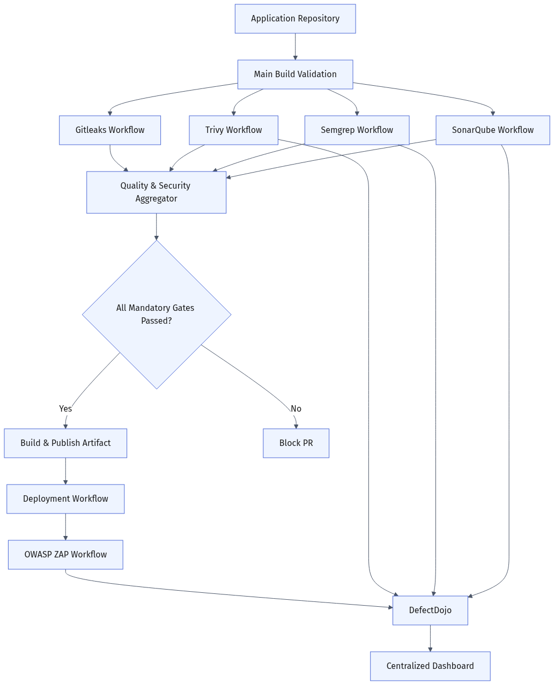
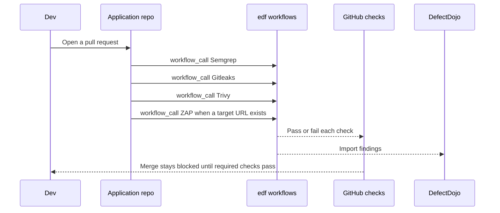

# edf

Enterprise DevSecOps Framework.

Reusable security pipelines for application repositories. This repository owns one workflow per tool. Application repositories call those workflows as build validation on pull requests.

## Planning

### Goal

Give every application the same security checks without copying scanner setup into each repository:

| Check | Tool | When it runs |
| --- | --- | --- |
| SAST | [Semgrep](https://github.com/semgrep/semgrep) | Every pull request |
| Secrets | [Gitleaks](https://github.com/gitleaks/gitleaks) | Every pull request |
| SCA, container, and IaC | [Trivy](https://github.com/aquasecurity/trivy) | Every pull request |
| DAST | [OWASP ZAP](https://www.zaproxy.org/) | When a running target URL exists |
| Findings hub | [DefectDojo](https://github.com/DefectDojo/django-DefectDojo) | After each scan |

Semgrep, Trivy, and ZAP are the merge checks. Gitleaks runs on every pull request and fails the check when it finds a secret. DefectDojo stores the findings so the same issue can be tracked across builds.

### Decisions

- One framework repository (`edf`) holds the workflows. Application code stays in its own repository.
- Each tool has its own workflow, so a team can turn a check on or off without editing the others.
- Application repositories call these workflows with GitHub Actions `workflow_call`. A failed required check blocks the pull request.
- Semgrep and Trivy run on every pull request. They do not need a deployed application.
- Semgrep runs on every pull request with the Semgrep CLI and the `p/default` rules. An ERROR finding fails the check. Metrics are off.
- Gitleaks runs on every pull request and scans the full git history. A finding fails the check. The default rules live in `.gitleaks.toml`.
- Trivy runs on every pull request as one check with three steps: `trivy fs` for dependency files, `trivy image` for container images, and `trivy config` for other config. A missing target is reported as nothing to scan and does not fail the check. A HIGH or CRITICAL finding fails the check.
- ZAP runs against a preview or staging URL. It starts in baseline mode so the first scans report findings without failing the build on unreviewed noise. It becomes a required check after the rules are tuned.
- Scan output is uploaded to DefectDojo. GitHub status checks decide pass or fail. DefectDojo is the system of record for triage.
- Code quality and test coverage stay with the application test job for now. This stack does not measure coverage and is not a substitute for a quality platform such as SonarQube. A later workflow can add that gate in the same repository.

### Phases

1. **Framework skeleton.** Reusable workflows for Semgrep and Trivy, plus a sample application repository that calls them on pull requests.
2. **DAST.** ZAP workflow that takes a target URL and publishes a report.
3. **Central reporting.** DefectDojo import from each workflow.
4. **Required checks.** Mark Semgrep and Trivy as required. Promote ZAP to required after baseline tuning.

### Repository layout

```text
edf/
  .github/workflows/
    semgrep.yml            # SAST, workflow_call
    gitleaks.yml           # secrets, workflow_call
    trivy.yml              # SCA / container / IaC, workflow_call
    zap.yml                # DAST, workflow_call
    defectdojo-import.yml  # push reports into DefectDojo
  .gitleaks.toml           # default secret rules
  Doc/
    architecture.png
  README.md
```

An application repository only adds a short caller workflow. It does not vendor the scanner configuration.

## Architecture



ZAP is skipped until the caller passes a target URL. Semgrep, Trivy, and Gitleaks always run.



## What an application repository adds

A caller workflow in the application repository, limited to inputs such as the language, the paths to scan, and the ZAP target URL. Scanner versions, rules, and report upload stay in `edf`.

```yaml
jobs:
  semgrep:
    name: Semgrep
    uses: kcmchandramouli/edf/.github/workflows/semgrep.yml@master
  gitleaks:
    name: Gitleaks
    uses: kcmchandramouli/edf/.github/workflows/gitleaks.yml@master
  trivy:
    name: Trivy
    uses: kcmchandramouli/edf/.github/workflows/trivy.yml@master
  zap:
    if: ${{ inputs.target_url != '' }}
    uses: kcmchandramouli/edf/.github/workflows/zap.yml@master
    with:
      target_url: ${{ inputs.target_url }}
```

Those `uses` paths are the intended contract. Semgrep, Gitleaks, and Trivy are in place. The other workflow files are part of the next implementation phase.
